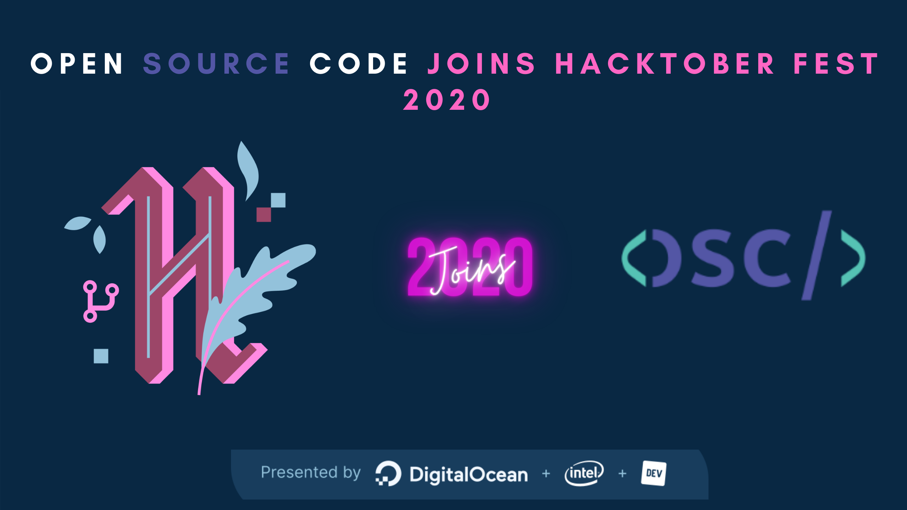

# Collaborate with Indeplot community.


<p align="center">

</p>


<!-- ALL-CONTRIBUTORS-BADGE:START - Do not remove or modify this section -->
[](#contributors-)
<!-- ALL-CONTRIBUTORS-BADGE:END -->

<p align="center">
   </a>
   </a>
   </a>
   </a>
</p>

## Indeplot is now part of Hacktoberfest 2020.

### Welcome to GitHub!
Make your first Pull Request and earn a free tee from GitHub!



### This project is perfect for your first pull request

### Instructions-

- Fork this Repository using the button at the top
- Clone your forked repository to your pc ( git clone ```'git@github.com:indeplot/indeplot.git'```)
- Create a new branch for your modifications (ie. `git branch new-user` and check it out `git checkout new-user` and `git checkout -b new-user`)
- Run ```yarn``` from inside the cloned project and run ```yarn start``` after the previous command execution.
- See the issues from the https://github.com/indeplot/indeplot/issues and comment and ask for   working
- After your assigned work do the following
- Add your files (`git add -A`), commit (`git commit -m "added myself"`) and push (`git push origin new-user`)
- Create a pull request to the `develop` branch and your pull request title must contain `[dev]` keyword and your work short title
- Star this repository

#### If your branch is not fully updated with the develop branch please follow the below instructions before making any PR

>CAUTION: Synch up your local repo with [original repo](https://github.com/indeplot/indeplot) (Upstream) before pushing your commits.
>This avoids unnecessary conflicts during the merge.

>NOTE: You can do so by adding a [remote handler](https://www.atlassian.com/de/git/tutorials/syncing) reference to the original repo and pull the changes from the respective branch.
>Resolve the [merge-conflicts](https://www.atlassian.com/de/git/tutorials/using-branches/merge-conflicts) if any.


>```bash
>#Add upstream repo
>git remote add upstream https://github.com/indeplot/indeplot.git
>
>#Disable accidental push to the upstream
>git remote set-url --push upstream DISABLE
>
>#List the remote repo and fetch references
>git remote -v && git fetch upstream
>
>#Check for any new commits in the upstream branch
>git log HEAD..upstream/master #No output indicates, upstream has not moved ahead
>
>#See the patch difference between local and upstream branch
>git diff -p HEAD..upstream/master
>
>```

>CAUTION: If the upstream has moved ahead, rebase your commit and resolve conflicts if any. [Skip otherwise]
>```bash
>git rebase upstream/master
>```
>

**7.** Push your local commits to the remote repo.

```bash
git push -u origin <your_branch_name>
```

**8.** Create a [PR](https://help.github.com/en/github/collaborating-with-issues-and-pull-requests/creating-a-pull-request) !

**9.** **Congratulations!** Sit and relax, you've made your contribution to [Indeplot](https://github.com/indeplot/indeplot) project.


* See the [Contributing Guidelines](https://github.com/indeplot/indeplot/blob/master/CONTRIBUTING.md) For more info.

## Maintainers ✨

Thanks goes to these wonderful people who are maintaining the project.

<table>
  <tr>
    <td align="center"><a href="https://github.com/ayan-biswas0412"><br /><sub><b>AYAN BISWAS</b></sub></a><br /><a href="#infra-ayan-biswas0412" title="Infrastructure (Hosting, Build-Tools, etc)">🚇</a></td>
  </tr>
</table>


## Contributors ✨

Thanks goes to these wonderful people who make this big

<!-- ALL-CONTRIBUTORS-LIST:START - Do not remove or modify this section -->
<!-- prettier-ignore-start -->
<!-- markdownlint-disable -->
<table>
  <tr>
    <td align="center"><a href="https://github.com/ayan-biswas0412"><br /><sub><b>AYAN BISWAS</b></sub></a><br /><a href="#infra-ayan-biswas0412" title="Infrastructure (Hosting, Build-Tools, etc)">🚇</a></td>
    <td align="center"><a href="https://dribbble.com/pearlpandz"><br /><sub><b>Muthupandi V</b></sub></a><br /><a href="#design-pearlpandz" title="Design">🎨</a></td>
    <td align="center"><a href="https://github.com/femakin"><br /><sub><b>femakin</b></sub></a><br /><a href="https://github.com/indeplot/indeplot/commits?author=femakin" title="Code">💻</a></td>
    <td align="center"><a href="https://github.com/varunpappu"><br /><sub><b>Varun Subramanian</b></sub></a><br /><a href="https://github.com/indeplot/indeplot/commits?author=varunpappu" title="Code">💻</a></td>
    <td align="center"><a href="https://github.com/abdulsamad"><br /><sub><b>AbdulSamad Ansari</b></sub></a><br /><a href="https://github.com/indeplot/indeplot/commits?author=abdulsamad" title="Code">💻</a></td>
    <td align="center"><a href="https://github.com/MissyM2"><br /><sub><b>MissyM2</b></sub></a><br /><a href="https://github.com/indeplot/indeplot/commits?author=MissyM2" title="Code">💻</a></td>
    <td align="center"><a href="https://github.com/ankit-rawani"><br /><sub><b>Ankit Rawani</b></sub></a><br /><a href="https://github.com/indeplot/indeplot/commits?author=ankit-rawani" title="Code">💻</a></td>
  </tr>
  <tr>
    <td align="center"><a href="https://suprdev.netlify.app"><br /><sub><b>Sunny Praksah</b></sub></a><br /><a href="https://github.com/indeplot/indeplot/commits?author=sprakash57" title="Code">💻</a></td>
    <td align="center"><a href="http://theamritanair.github.io"><br /><sub><b>Amrita Nair</b></sub></a><br /><a href="https://github.com/indeplot/indeplot/commits?author=theamritanair" title="Code">💻</a></td>
<<<<<<< HEAD
    <td align="center"><a href="https://github.com/rdhaundiyal-indeed"><br /><sub><b>rdhaundiyal-indeed</b></sub></a><br /><a href="https://github.com/indeplot/indeplot/commits?author=rdhaundiyal-indeed" title="Code">💻</a></td>
=======
    <td align="center"><a href="http://ieshaan12.github.io"><br /><sub><b>Ieshaan Saxena</b></sub></a><br /><a href="https://github.com/indeplot/indeplot/commits?author=ieshaan12" title="Code">💻</a></td>
>>>>>>> e09c0eb82682d7f62f2776a9cb8c9178b63ddd78
  </tr>
</table>

<!-- markdownlint-enable -->
<!-- prettier-ignore-end -->
<!-- ALL-CONTRIBUTORS-LIST:END -->

This project follows the [all-contributors](https://github.com/all-contributors/all-contributors) specification. Contributions of any kind welcome ,also please discover issues and star the repository if you like it!

